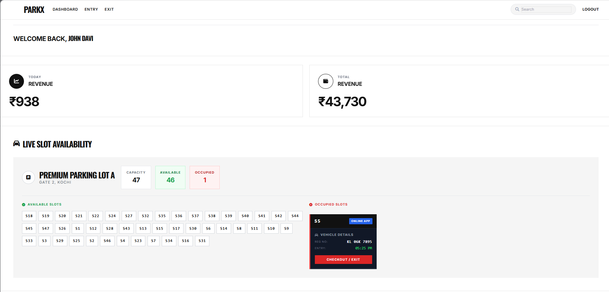
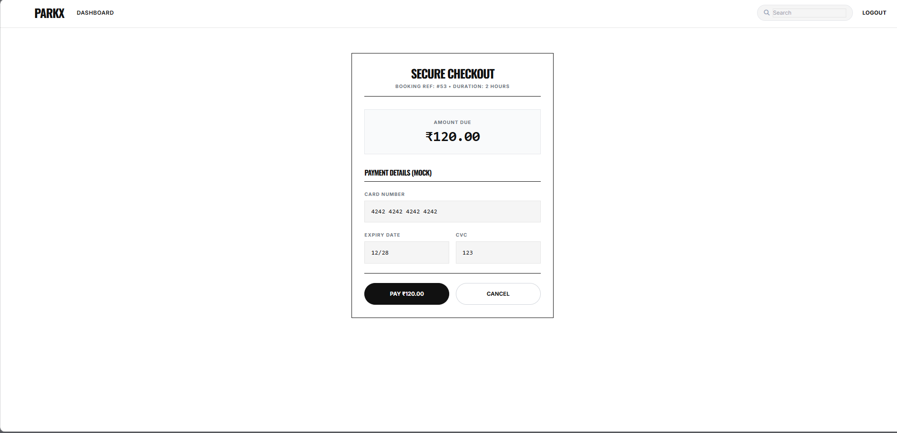

  <h1>ParkX</h1>
  
<b>City-Level Vehicle Parking Management System</b>

  

    
    
    
    
  

  

    A centralized web application designed to modernize urban parking infrastructure. 
    Developed as a <b>BSc Computer Science project</b> at <b>Rajagiri College of Social Sciences</b>.
  

## Table of Contents

- [Core Features](#core-features)
- [Technology Stack](#technology-stack)
- [Screenshots](#screenshots)
- [Getting Started](#getting-started)

## Core Features

### Real-Time Parking Matrix
A responsive live grid that mirrors the actual parking layout on the Owner Dashboard. Parking slots automatically update their status (Available / Occupied) when a QR ticket is scanned.

### Concurrency Control
Utilizes database transactions (`DB::transaction`) during the booking phase to eliminate race conditions and prevent double booking.

### Live QR Ticket Scanning
Features an integrated webcam scanner using `html5-qrcode`, allowing operators to instantly verify and check-in vehicles upon arrival.

### Security Validation
Mandates vehicle condition video uploads during booking, utilizing both client-side interception and server-side MIME validation.

### Dynamic Time Extensions
Users can extend parking duration through a secure mock checkout system. A 10-minute grace period is provided prior to the application of late fines.

### Automated Slot Expiry
Implements Laravel Task Scheduling to automatically free up slots if payment is not completed within 15 minutes of booking initiation.

## Technology Stack

| Category | Technologies |
| :--- | :--- |
| **Backend** | Laravel 12 (PHP 8.2) |
| **Database** | PostgreSQL |
| **Frontend** | Blade Templates, HTML5, Tailwind CSS, JavaScript (ES6) |
| **Integration** | Simple-QRCode (Generator), HTML5-QRCode (Scanner) |
| **Version Control** | Git, GitHub |

## Screenshots

*(Ensure your images are uploaded to the `screenshots` directory in your repository root)*

### Owner Parking Matrix

  

### User Dashboard & QR Ticket

  

### Mock Payment Gateway

  

## Getting Started

### Prerequisites
Ensure the following tools are installed on your local environment:
- PHP >= 8.2
- Composer
- PostgreSQL
- Node.js & NPM
- Git

### Local Installation

**1. Clone the repository**

git clone [https://github.com/Amalbiju27/ParkX.git](https://github.com/Amalbiju27/ParkX.git)
cd ParkX
2. Install dependencies

Bash
composer install
npm install
npm run build
3. Configure environment

Bash
cp .env.example .env
php artisan key:generate
Open .env and configure your PostgreSQL database credentials and set APP_TIMEZONE=Asia/Kolkata.

4. Run database migrations

Bash
php artisan migrate --seed
5. Link storage (for file uploads)

Bash
php artisan storage:link
6. Start the development server

Bash
php artisan serve
Access the application at http://127.0.0.1:8000.

7. Run the background scheduler

Bash
php artisan schedule:work

Developed by <b>Amal Biju</b>

